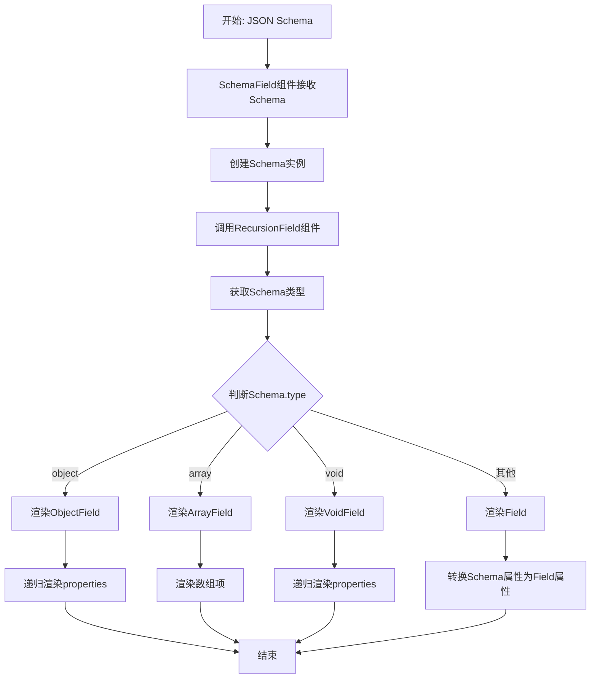

# Formily JSON Schema 渲染过程详解

## 1. 实现思路

Formily 通过一套完整的组件体系，实现了将 JSON Schema 转换为可交互表单的能力。其核心思想是：

1. **Schema 解析与转换**：将 JSON Schema 对象转换为 Schema 实例，提供更多的方法和功能
2. **递归渲染机制**：通过递归组件遍历 Schema 结构，逐层渲染表单元素
3. **类型映射**：根据 Schema 的 type 属性映射到相应的字段组件
4. **属性转换**：将 Schema 定义的属性转换为字段组件的实际属性
5. **上下文传递**：通过 React Context 在组件树中传递必要的信息

## 2. 核心组件与代码位置

### 2.1 SchemaField 组件

- **职责**：接收并处理 JSON Schema，作为渲染入口
- **代码位置**：`packages/react/src/components/SchemaField.tsx`

### 2.2 RecursionField 组件

- **职责**：递归渲染 Schema 结构，是核心渲染逻辑
- **代码位置**：`packages/react/src/components/RecursionField.tsx`

### 2.3 字段组件

- **ObjectField**：渲染对象类型字段
  - 代码位置：`packages/react/src/components/ObjectField.tsx`
- **ArrayField**：渲染数组类型字段
  - 代码位置：`packages/react/src/components/ArrayField.tsx`
- **Field**：渲染基本类型字段
  - 代码位置：`packages/react/src/components/Field.tsx`
- **VoidField**：渲染空类型字段（用于布局）
  - 代码位置：`packages/react/src/components/VoidField.tsx`

### 2.4 Schema 处理

- **Schema 类**：处理 JSON Schema 的核心类
  - 代码位置：`packages/json-schema/src/index.ts`

## 3. 详细实现流程

### 3.1 Schema 初始化

```typescript
// packages/react/src/components/SchemaField.tsx
const schema = Schema.isSchemaInstance(props.schema)
  ? props.schema
  : new Schema({
      type: 'object',
      ...props.schema,
    })
```

### 3.2 递归渲染逻辑

```typescript
// packages/react/src/components/RecursionField.tsx
export const RecursionField: ReactFC<IRecursionFieldProps> = (props) => {
  const basePath = useBasePath(props)
  const fieldSchema = useMemo(() => new Schema(props.schema), [props.schema])
  const fieldProps = useFieldProps(fieldSchema)

  const render = () => {
    if (!isValid(props.name)) return renderProperties()
    if (fieldSchema.type === 'object') {
      return (
        <ObjectField {...fieldProps} name={props.name} basePath={basePath}>
          {renderProperties}
        </ObjectField>
      )
    } else if (fieldSchema.type === 'array') {
      return (
        <ArrayField {...fieldProps} name={props.name} basePath={basePath} />
      )
    } else if (fieldSchema.type === 'void') {
      return (
        <VoidField {...fieldProps} name={props.name} basePath={basePath}>
          {renderProperties}
        </VoidField>
      )
    }
    return <Field {...fieldProps} name={props.name} basePath={basePath} />
  }
}
```

### 3.3 属性转换

```typescript
// packages/react/src/components/RecursionField.tsx
const useFieldProps = (schema: Schema) => {
  const scope = useExpressionScope()
  return schema.toFieldProps({
    scope,
  }) as any
}
```

## 4. 技术框架图

```
┌─────────────────────────────────────────────────────────────────┐
│                    JSON Schema 渲染框架                           │
├─────────────────────────────────────────────────────────────────┤
│                                                                 │
│  ┌─────────────────┐     ┌──────────────────┐     ┌─────────────┐│
│  │   JSON Schema   │────▶│  Schema 实例     │────▶│  SchemaField││
│  │                 │     │                  │     │             ││
│  └─────────────────┘     └──────────────────┘     └─────────────┘│
│                              │                                   │
│                              ▼                                   │
│                    ┌─────────────────────────┐                   │
│                    │   RecursionField        │                   │
│                    │                         │                   │
│                    │  ┌─────────────────────┐│                   │
│                    │  │递归解析Schema结构    ││                   │
│                    │  └─────────────────────┘│                   │
│                    │                         │                   │
│                    │  ┌─────────────────────┐│                   │
│                    │  │根据type选择组件      ││                   │
│                    │  └─────────────────────┘│                   │
│                    │                         │                   │
│                    │  ┌─────────────────────┐│                   │
│                    │  │转换Schema属性       ││                   │
│                    │  └─────────────────────┘│                   │
│                    └─────────────────────────┘                   │
│                              │                                   │
│                              ▼                                   │
│  ┌─────────────────┐     ┌──────────────────┐     ┌─────────────┐│
│  │   ObjectField   │◀───▶│   Field组件      │◀───▶│  ArrayField ││
│  │                 │     │                  │     │             ││
│  └─────────────────┘     └──────────────────┘     └─────────────┘│
│                              │                                   │
│                              ▼                                   │
│                    ┌─────────────────────────┐                   │
│                    │   最终渲染的表单元素     │                   │
│                    └─────────────────────────┘                   │
│                                                                 │
└─────────────────────────────────────────────────────────────────┘
```

## 5. 逻辑流程图



## 6. 关键实现细节

### 6.1 上下文传递机制

- **SchemaContext**：传递当前 Schema 实例
- **SchemaComponentsContext**：传递可用的组件映射
- **ExpressionScope**：传递表达式作用域

### 6.2 递归渲染策略

- **对象类型**：渲染 ObjectField 并递归渲染其 properties
- **数组类型**：渲染 ArrayField，处理数组项的渲染
- **空类型**：渲染 VoidField，主要用于布局组件
- **基本类型**：渲染 Field，处理具体的输入控件

### 6.3 属性映射机制

- **x-component**：指定使用的组件
- **x-decorator**：指定装饰器组件
- **x-validator**：指定验证规则
- **x-reactions**：指定联动逻辑

## 7. 扩展能力

### 7.1 自定义组件

通过 `createSchemaField` 函数可以注册自定义组件映射。

### 7.2 表达式支持

支持在 Schema 中使用表达式，实现动态属性设置。

### 7.3 插槽机制

支持 `x-slot-node` 实现自定义插槽渲染。

## 8. 性能优化

- **响应式更新**：利用 @formily/reactive 实现精确更新
- **批量处理**：使用 batch 方法合并多次更新
- **缓存机制**：对 Schema 解析结果进行缓存

## 9. 总结

Formily 的 JSON Schema 渲染机制通过组件化的递归渲染方式，实现了从静态 Schema 到动态表单的转换。这种设计不仅支持后端驱动表单，还提供了强大的扩展能力和灵活的配置选项，是现代表单解决方案的优秀实践。
